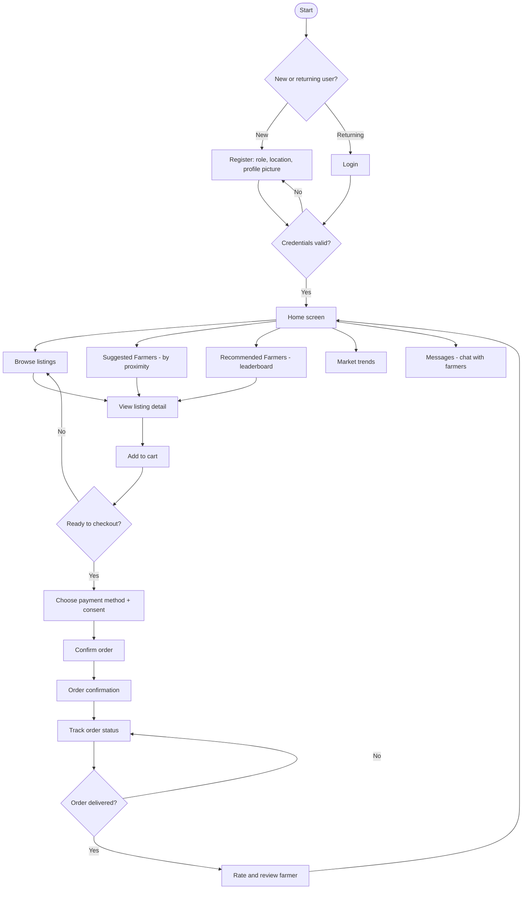
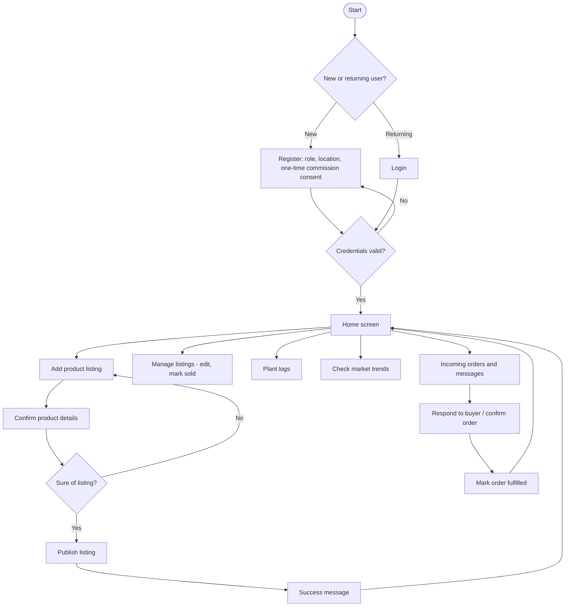

# FarmConnect — Technical & Product Spec
*For solo build in VS Code. Covers every feature from the drawing-board notes, scoped for the Week 13 exhibition demo.*

---

## 0. Stack Recommendation (resolving the Firebase/Supabase question)

**Recommendation: consolidate everything on Supabase. Drop Firebase entirely.**

Reasoning:
- Your data is fundamentally **relational**: a listing belongs to a farmer, has many images, gets ordered by a buyer, appears in price trends, feeds a leaderboard score. That's joins and foreign keys — Postgres (Supabase) is built for this; Firestore (Firebase) is a NoSQL document store that fights you on exactly this kind of data.
- Supabase Auth already does email/password **and** Google OAuth — you don't need Firebase for that.
- Supabase Storage already handles images — no need for a second storage vendor.
- Running two backend vendors means two auth states to keep in sync, two dashboards, two sets of security rules, and no benefit for a solo build. One vendor = one thing to learn well.

---

## 1. Final Tech Stack

| Layer | Tool |
|---|---|
| Frontend | React (Vite) + Tailwind CSS |
| Backend / APIs | Supabase auto-generated REST API + Edge Functions (for leaderboard scoring, seasonal tips logic) |
| Database | Supabase Postgres |
| File Storage | Supabase Storage (listing images, profile pictures, ID documents) |
| Auth | Supabase Auth (email/password + Google OAuth) |
| Hosting | Vercel |
| Version Control / CI/CD | GitHub → Vercel auto-deploy |
| Error Tracking | Sentry |

---

## 2. Design Principles (from your notes)

- **Mobile-first, always.** Design and build every screen for a phone screen first; desktop is an afterthought, not the default.
- **No generic dull landing page.** The homepage needs real visual content — actual produce photography (or well-chosen stock images for the demo), not empty white space and placeholder text.
- **No gradients**, on background or text. Flat, deliberate color use.
- **No fluffy "Welcome to FarmConnect!" filler text.** Get straight to the value: what a farmer or buyer can *do* here, above the fold.
- **Marketplace cards must not look generic.** Each listing card should feel specific to the product — real product photo prominent, price and quantity legible at a glance, farmer name/location visible, not a generic "product card" template.

---

## Corrected User Flows

*Reviewed against your two hand-drawn flowcharts. Fixes applied: payment method is chosen before consent is asked (not after); a "no" on payment/checkout returns to that same step instead of discarding the cart back to browsing; commission consent is a one-time step at registration rather than repeated on every listing; Register and Login are split into distinct paths; a post-order rating step feeds the Recommended Farmers leaderboard; and Plant Logs, listing management, order tracking, and buyer–farmer messaging — all present in your notes but missing from the original flowcharts — are now included. The "go back home?" prompt is replaced by a persistent nav bar rather than a decision node repeated after every action.*

### Buyer flow



### Farmer flow



---

## 3. Data Model

```
users
  id (uuid, pk)
  role                 enum: 'farmer' | 'buyer' | 'admin'
  full_name            text
  phone_number         text (unique, used for MTN MoMo linkage)
  email                text (nullable — Google OAuth may not need it exposed)
  profile_picture_url  text
  id_document_url      text (nullable — optional verification, see 4.1)
  is_verified          boolean (default false)
  buyer_type           enum: 'household' | 'retail' | 'institutional' (nullable, buyers only)
  settlement_type       enum: 'rural' | 'urban'
  inkhundla             text (nullable — rural only, see 4.1)
  landmark_mountain    text (nullable — rural only)
  landmark_river       text (nullable — rural only)
  street_address        text (nullable — urban only)
  house_number          text (nullable — urban only)
  plot_number            text (nullable — urban only, optional)
  latitude             float (nullable — approximate, from inkhundla centroid or geocoded urban address if available)
  longitude            float (nullable)
  subscription_tier    enum: 'free' | 'premium' (default 'free')
  commission_consent_given  boolean (default false — set once at farmer registration, not per listing)
  created_at           timestamp

listings
  id (uuid, pk)
  farmer_id            fk -> users.id
  product_type         text (e.g. "maize", "spinach", "cattle")
  description          text
  quantity             numeric
  unit                 text (kg, bags, head, etc.)
  price                numeric
  harvest_date         date (nullable)
  status               enum: 'available' | 'reserved' | 'sold'
  created_at           timestamp

listing_images
  id (uuid, pk)
  listing_id           fk -> listings.id
  image_url            text
  sort_order           int (0, 1, 2 — max 3 per listing, per your notes)

orders
  id (uuid, pk)
  buyer_id             fk -> users.id
  listing_id           fk -> listings.id
  quantity_ordered     numeric
  order_status         enum: 'pending' | 'confirmed' | 'delivered' | 'cancelled'
  payment_status        enum: 'unpaid' | 'paid'
  commission_amount    numeric (calculated at confirm time)
  created_at           timestamp

price_trends
  id (uuid, pk)
  product_type         text
  region                text
  recorded_price        numeric
  recorded_date         date

reviews
  id (uuid, pk)
  reviewer_id           fk -> users.id
  target_user_id        fk -> users.id
  rating                 int (1–5)
  comment                text
  created_at             timestamp

plant_logs
  id (uuid, pk)
  farmer_id              fk -> users.id
  crop_type               text
  planting_date           date
  expected_harvest_date   date
  notes                   text
  created_at              timestamp

farmer_stats  (materialized, recomputed periodically — powers "Recommended Farmers")
  farmer_id               fk -> users.id
  goods_sold_count        int
  avg_rating              numeric
  response_rate           numeric
  recommended_score        numeric (see 4.3 formula)
  last_calculated          timestamp

seasonal_tips
  id (uuid, pk)
  product_type            text
  region                   text
  month                    int (1–12)
  tip_text                 text
  trend_direction           enum: 'price_rising' | 'price_falling' | 'stable'

messages
  id (uuid, pk)
  order_id               fk -> orders.id (nullable — a chat can start before an order exists)
  sender_id              fk -> users.id
  recipient_id           fk -> users.id
  body                    text
  read_at                 timestamp (nullable)
  created_at              timestamp
```

---

## 4. Feature Specs

### 4.1 Auth & Onboarding
- **Separate Sign In and Register pages** (not a combined modal/pop-up).
- Registration options: email/password, or **Google OAuth** via Supabase Auth.
- Registration form fields:
  - Role selection (farmer / buyer) first — form branches based on this.
  - **Settlement type toggle** (both roles): **Rural** or **Urban**. This determines which location fields appear next — the two settlement types need genuinely different address models, not one generic "address" field.
    - **Rural**: dropdown of **Inkhundla** (start with the 16 in Manzini region for the pilot — see list below), free-text field for nearest **mountain**, free-text field for nearest **river/Umfula**. These three combine to give a usable location even without a formal street address.
    - **Urban**: **street address** field, **house number**, and an **optional plot number**. This is a simpler, more conventional address form since urban areas have formal addressing.
  - Buyers: profile picture upload (your note: "so buyers can find them easily" — this displays on their orders/messages so farmers recognize them too).
  - Optional **ID / proof-of-residence upload**: recommend making this an **opt-in "Verified" badge** completed *after* initial signup, not a blocker at registration. This avoids adding friction to your very first pilot sign-ups while still giving you the trust signal for later.
- **Manzini region Inkhundla list (real, for your dropdown):** Ekukhanyeni, Hlambanyatsi, Kwaluseni, Lamgabhi, Lobamba Lomdzala, Ludzeludze, Mafutseni, Mahlangatja, Mangcongco, Manzini North, Manzini South, Mkhiweni, Mtfongwaneni, Ngwempisi, Nhlambeni, Ntondozi.
- Account deletion: available from account settings, must show a confirmation dialog ("Are you sure you want to delete this account? This cannot be undone.") before executing.
- Profile picture can be changed at any time from account settings.

### 4.2 Listings & Marketplace Cards
- Farmer creates a listing: product type, description, quantity, unit, price, harvest date, **up to 3 images**.
- Images display as a **swipeable carousel** on the listing card and detail page (left/right swipe, dot indicators).
- Card design: large product photo, price and quantity prominent, farmer name + inkhundla visible, avoid generic icon-only placeholder cards.

### 4.3 Suggested Farmers (proximity) & Recommended Farmers (leaderboard)
- **Suggested Farmers**: when a buyer searches for a product, show listings ranked by geographic proximity to the buyer, using `latitude`/`longitude` (haversine distance calculation) regardless of whether that coordinate came from an inkhundla centroid (rural) or a geocoded street address (urban) — the distance calculation itself doesn't care which settlement type either party is, it just needs both users to have a lat/lng populated. Label this section "Suggested Farmers."
- **Recommended Farmers**: a dedicated section where buyers can browse top-performing farmers platform-wide, independent of search. Suggested scoring formula for `recommended_score` (tune weights after real data comes in):

```
recommended_score =
    (0.4 × normalized_goods_sold_count) +
    (0.4 × normalized_avg_rating) +
    (0.2 × normalized_response_rate)
```

Recompute via a scheduled Supabase Edge Function (e.g. nightly) rather than live on every page load.

### 4.4 Plant Logs
- Farmer-only feature: a simple form to log crop type, planting date, expected harvest date, and free-text notes — replacing the paper notebook mentioned in your research notes.
- List view per farmer, sortable by planting date.
- This is a private record (RLS: only the farmer who created it can read/write it) — it is not shown to buyers, though a future version could optionally let a farmer publish a log entry as a listing draft.

### 4.5 Seasonal / Market Trend Tips
- Simple rule-based tip engine reading from `seasonal_tips`, matched by `product_type`, `region`, and current `month`.
- Displayed on the market-trends dashboard and, contextually, when a farmer is about to create a listing for a product with an active seasonal tip.
- Example (from your notes): spinach in November — low demand, high supply, price falls; but demand rises entering the dry winter season when supply is constrained. Seed this table with a handful of real examples like this for the demo rather than trying to build a forecasting model — a rules table is enough to demonstrate the concept.

### 4.6 Monetization
- `orders.commission_amount` calculated at order confirmation (5% per the business plan's financial model).
- `users.subscription_tier` supports a future premium tier (deeper price-trend history, priority placement in Suggested Farmers) — build the field now, gate the actual premium features later.
- Commission terms are shown and agreed to **once**, at farmer registration (`commission_consent_given`), not re-asked on every listing. If a farmer declines, block registration completion rather than letting them create listings without having agreed to terms.

### 4.7 Buyer–Farmer Messaging
- Simple threaded chat, optionally tied to an order (`messages.order_id`) or standalone (a buyer messaging a farmer before ordering).
- Farmer-side: an inbox of incoming messages and order-related questions, surfaced from the Home screen ("Incoming orders and messages").
- Keep this minimal for the pilot — a plain message list is enough; no read receipts or typing indicators needed for the demo.

### 4.8 Order Management, Tracking, and Reviews
- Buyers see order status (`orders.order_status`: pending → confirmed → delivered) on a Track Order screen, not just a one-time confirmation message.
- Once an order reaches `delivered`, the buyer is prompted to rate the farmer (writes to `reviews`, which feeds the `farmer_stats.avg_rating` used by the Recommended Farmers leaderboard — see 4.3).
- Farmers see and act on incoming orders from the same Home entry point as messaging (4.7): confirm, or mark fulfilled.

### 4.9 Listing Management
- Farmers need a "Manage Listings" view separate from "Add Listing" — list of their own listings with status (`available` / `reserved` / `sold`), and the ability to edit price/quantity or mark an item sold without recreating it.

---

## 5. Screens / Sitemap

1. Landing page (public) — value proposition, no gradients, no filler welcome text, real imagery
2. Sign In
3. Register (role-branching: farmer / buyer; farmers see one-time commission consent here)
4. Farmer Dashboard — my listings, plant logs, stats
5. Buyer Dashboard — my orders, saved/followed farmers
6. Create Listing (with 3-image upload)
7. Manage Listings (farmer: view/edit/mark sold — separate from creation)
8. Listing Detail (image carousel, order button)
9. Marketplace / Browse (search, filters, Suggested Farmers section)
10. Recommended Farmers (leaderboard)
11. Market Trends Dashboard (price charts + seasonal tips)
12. Plant Log (farmer-only)
13. Cart / Checkout (choose payment method + consent, in that order)
14. Order Confirmation
15. Track Order (buyer: status; farmer: incoming orders to confirm/fulfil)
16. Rate Farmer (prompted after order marked delivered)
17. Messages / Chat (buyer ↔ farmer, optionally tied to an order)
18. Account Settings (edit profile picture, verification upload, delete account with confirmation)

---

## 6. Suggested Build Order

Given everything from your notes is in scope for the Week 13 demo, build in this order so you always have something demoable, even if you run out of time before the last items:

1. Supabase project setup: schema above, RLS policies, Auth (email + Google OAuth)
2. Register/Sign In pages (split, not combined), role branching, Manzini inkhundla dropdown, one-time commission consent for farmers
3. Create Listing (3-image carousel upload) + Manage Listings (edit/mark sold) + Marketplace browse/search
4. Listing Detail + Cart/Checkout (payment method chosen before consent) + Order Confirmation
5. Track Order (both roles) + Rate Farmer step after delivery
6. Account Settings (profile picture, delete account with confirmation)
7. Market Trends dashboard + seed `seasonal_tips` table with real examples
8. Suggested Farmers (proximity) on search results
9. Recommended Farmers leaderboard (Edge Function scoring, fed by 4.8's reviews)
10. Messages/chat (4.7) + Plant Logs (4.4)
11. Polish pass on landing page and card design against the design principles in Section 2

---

## 7. Open Decisions to Confirm Before Building

- Exact list of product types to support at launch (maize, spinach, + how many others?) — affects `seasonal_tips` seed data.
- Whether `inkhundla` proximity uses a fixed centroid lat/lng per inkhundla (simpler, good enough for a pilot) or actual GPS capture at signup (more accurate, more friction).
- Whether urban street addresses get geocoded automatically at registration (e.g. via a geocoding API) or the user drops a pin on a map manually — automatic geocoding is smoother but adds an external API dependency; a manual pin keeps everything on your own stack.
- Commission percentage: confirmed at 5% in the financial plan — keep in sync if that changes.
